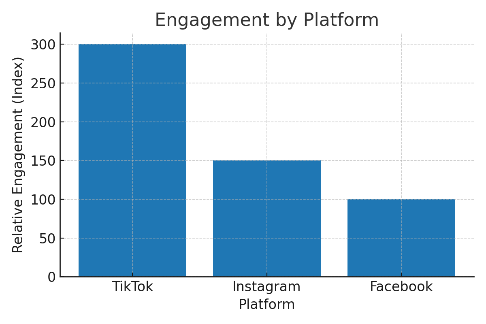
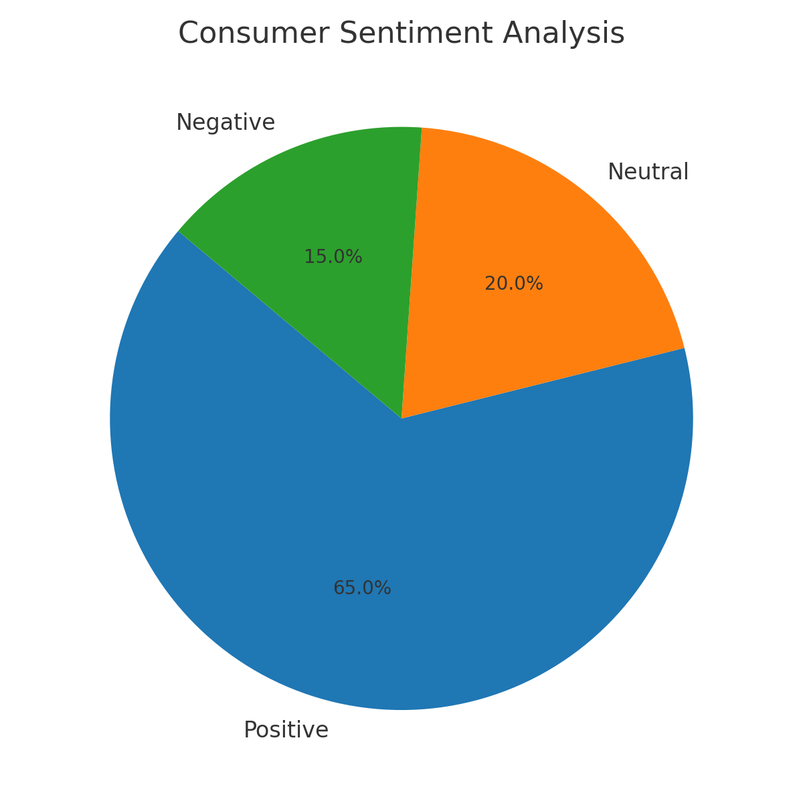

# 📊 Coca-Cola Social Media Insights Case Study  

## 📌 Overview  
This case study analyzes **Coca-Cola’s strategic use of social media insights** to optimize marketing campaigns, identify consumer trends, and strengthen brand positioning in a competitive beverage market.  

## 🎯 Business Problem  
- Traditional research methods failed to capture **real-time sentiment**.  
- Coca-Cola faced **competitive pressure** from rivals using digital platforms.  
- ROI measurement for campaigns was **fragmented across regions**.  

## ✅ Objectives  
1. Capture **real-time consumer sentiment** through social listening.  
2. Identify **emerging beverage trends** among Gen Z & Millennials.  
3. Measure **campaign effectiveness** and influencer ROI.  
4. Provide **data-driven recommendations** for strategy.  

## 🛠️ Data Sources & Tools  
- **Social Media**: Twitter (X), Instagram, Facebook, TikTok, YouTube  
- **Tools**: Sprinklr, Brandwatch, Tableau, Power BI  
- **Data Points**: Hashtag performance, engagement, sentiment, geolocation, impressions  

## 🔎 Approach & Methodology  
1. **Social Listening** → Monitored hashtags & applied sentiment analysis.  
2. **Trend Analysis** → Identified zero-sugar & sustainability trends.  
3. **Campaign ROI** → Tracked influencer campaigns & linked to sales data.  
4. **Dashboards** → Built Power BI dashboards & monthly insights reports.  

## 📊 Key Findings  
- TikTok challenges delivered **3x higher engagement** than Facebook.  
- **Sustainability campaigns** generated the most positive sentiment.  
- Zero Sugar mentions grew **20% YoY**.  
- Latin America showed **rising demand for energy drinks**.  

## 💡 Business Impact  
- Reallocated **25% ad spend** from Facebook to TikTok/Instagram.  
- Accelerated **launch of zero-sugar products**.  
- Boosted social engagement by **35% in 12 months**.  
- Strengthened Coca-Cola’s **sustainable, innovative brand image**.  

## 📑 Deliverables  
- [📄 Full Case Study PDF](CocaCola_CaseStudy.pdf)  
- 📊 Visuals:  
  -   
  -   
  -   
  -   

## 🧰 Tools Used  
- **Python** → Data visualization & ReportLab PDF generation  
- **Power BI & Tableau** → Dashboard prototyping  
- **Sprinklr & Brandwatch** → Social media analytics  

---

⭐ *This project demonstrates business analyst skills in social listening, data storytelling, and actionable insights for enterprise decision-making.*  
