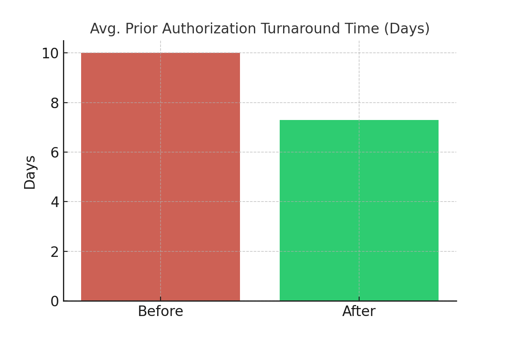
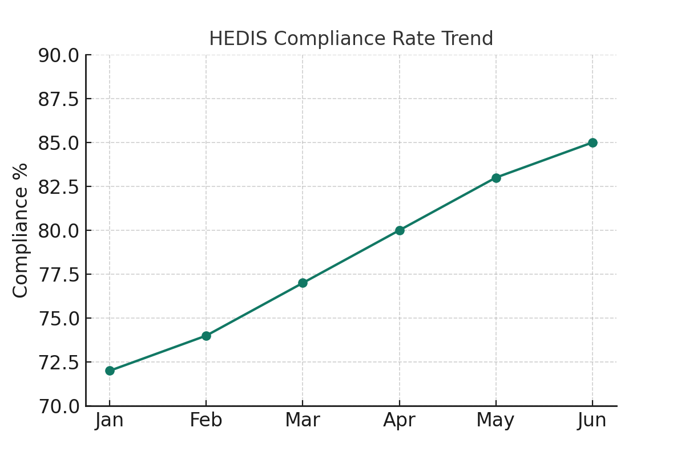
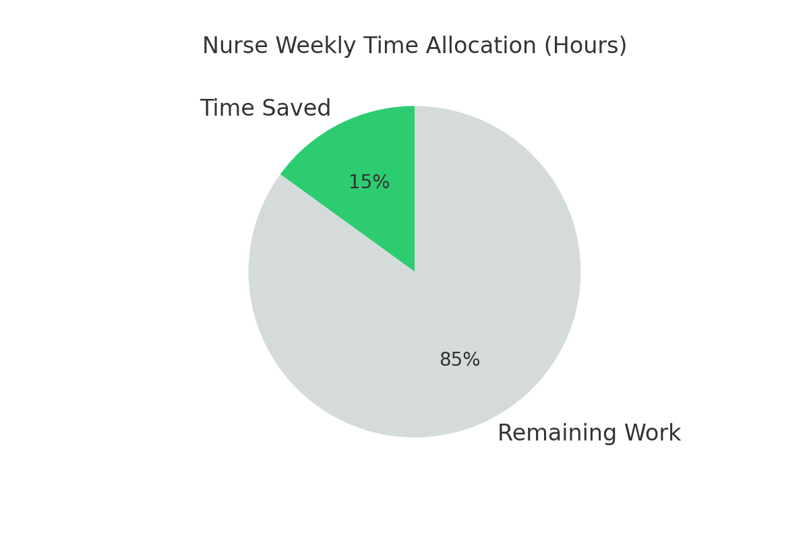

# 📊 Healthcare Business Analyst Case Study  

[](Healthcare_BA_Case_Study.sql)
[]()
[]()
[]()

---

## 🩺 Project Overview  
This case study demonstrates how a **Business Analyst** applied requirements gathering, process mapping, and data analytics to improve **utilization management (UM)**, **clinical quality reporting (HEDIS/STAR)**, and **nurse workflow efficiency** for a mid-sized health insurer.  

The project highlights measurable impact in **efficiency, compliance, and patient outcomes** through **business analysis and SQL-driven insights**.

---

## ⚠️ Business Problem  
The organization struggled with:  
- ⏳ Long **prior authorization turnaround times**  
- 📉 Inconsistent **clinical quality reporting** (HEDIS/STAR)  
- 🧑‍⚕️ Manual workloads overwhelming nurse case managers  
- 🔍 Limited **population health visibility**  

---

## 🎯 Objectives  
- Reduce prior authorization turnaround time by **20%**  
- Automate and standardize **HEDIS/STAR reporting**  
- Save nurse case managers **6+ hours per week**  
- Improve dashboards for **high-risk patient monitoring**  

---

## 🔧 Approach  
- **Requirements Gathering** → Stakeholder interviews, As-Is / To-Be workflows (Lucidchart)  
- **SQL + Data Analysis** → Extracted, cleaned, and aggregated claims & clinical data  
- **Power BI Mock Dashboards** → Visualized turnaround time, compliance trends, nurse productivity  
- **System Configuration** → Auto-approval rules for low-risk requests  
- **Change Management** → UAT + staff training  

---

## 🚀 Results  
| Metric                          | Before | After | Impact        |
|--------------------------------|--------|-------|---------------|
| Prior Auth Turnaround (days)   | 10     | 7.3   | **27% faster** |
| HEDIS Compliance Errors        | High   | Low   | **-40%**      |
| Nurse Manual Hours Saved       | 0      | 6/wk  | **+6 hrs**    |
| ER Admissions (high-risk)      | Higher | Lower | Improved      |

✅ Stronger compliance with **NCQA / CMS**  
✅ Nurses shifted focus from admin work to **patient care**  

---

## 📂 Deliverables  
- 📄 [Case Study PDF](Healthcare_BA_Case_Study_Visuals.pdf)  
- 🧑‍💻 Full SQL Script (see below & [Healthcare_BA_Case_Study.sql](Healthcare_BA_Case_Study.sql))  
- 📈 Dashboard-Style Visuals:  
  -   
  -   
  -   

---

## 🧑‍💻 Full SQL Snippet (Nurse Time Savings)  

```sql
-- Nurse Time Saved Summary
CREATE OR REPLACE VIEW healthcare_ba.v_nurse_time_saved_summary AS
SELECT
   (MAX(CASE WHEN workflow_version=0 THEN minutes_spent END)/60.0) AS before_hours,
   (MAX(CASE WHEN workflow_version=1 THEN minutes_spent END)/60.0) AS after_hours,
   ((MAX(CASE WHEN workflow_version=0 THEN minutes_spent END)/60.0)
    - (MAX(CASE WHEN workflow_version=1 THEN minutes_spent END)/60.0)) AS hours_saved
FROM healthcare_ba.nurse_time_logs;
