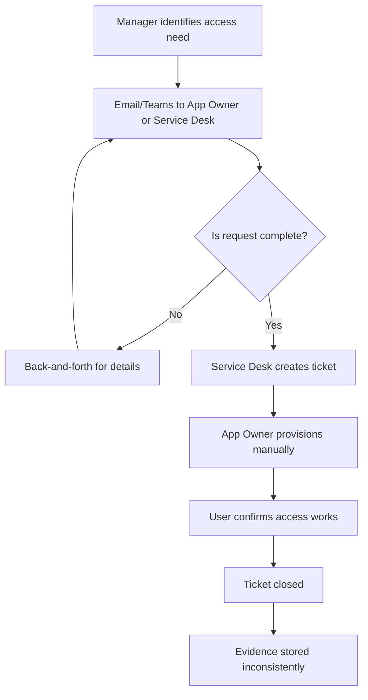

# As‑Is Process — Access Provisioning (Manual)

```mermaid
flowchart TD
A[Manager identifies access need] --> B[Email/Teams to App Owner or Service Desk]
B --> C{Is request complete?}
C -- No --> D[Back-and-forth for details]
D --> B
C -- Yes --> E[Service Desk creates ticket]
E --> F[App Owner provisions manually]
F --> G[User confirms access works]
G --> H[Ticket closed]
H --> I[Evidence stored inconsistently]
```

## Pain points
- No standardized approvals
- Delayed provisioning/deprovisioning
- Hard to produce audit evidence
