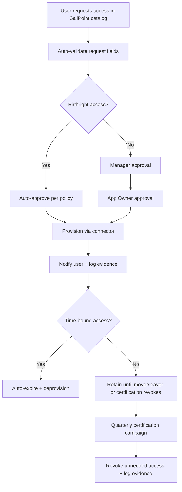

# To‑Be Process — Access Provisioning (SailPoint)

```mermaid
flowchart TD
A[User requests access in SailPoint catalog] --> B[Auto-validate request fields]
B --> C{Birthright access?}
C -- Yes --> D[Auto-approve per policy] --> G[Provision via connector]
C -- No --> E[Manager approval] --> F[App Owner approval] --> G[Provision via connector]
G --> H[Notify user + log evidence]
H --> I{Time-bound access?}
I -- Yes --> J[Auto-expire + deprovision]
I -- No --> K[Retain until mover/leaver or certification revokes]
K --> L[Quarterly certification campaign]
L --> M[Revoke unneeded access + log evidence]
```

## Improvements
- Standardized approvals and routing
- Automated provisioning/deprovisioning
- Audit-ready evidence logs and reports
